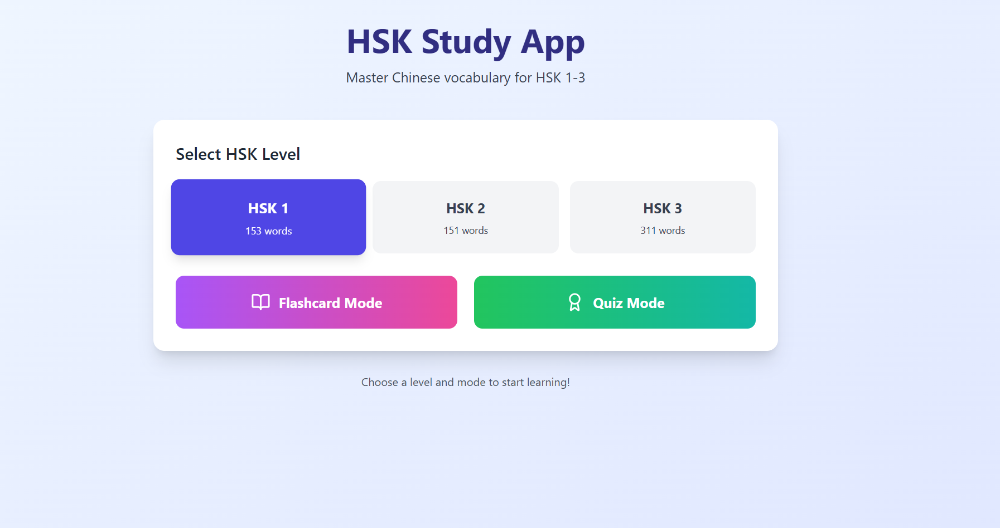
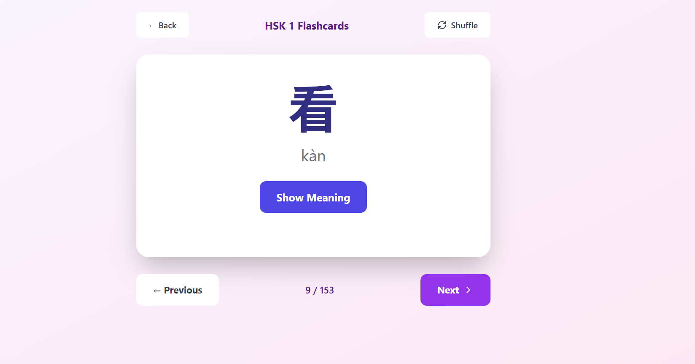
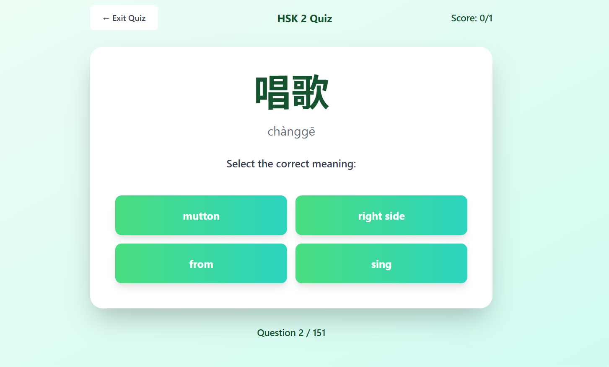
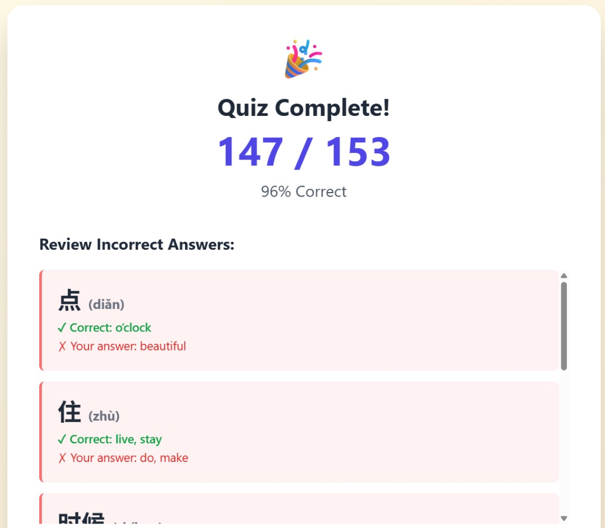

# HSK Study App 📚

A modern, interactive web application built with React to help you master Chinese vocabulary for HSK levels 1-3. Features flashcards, quizzes, and progress tracking to make learning Mandarin effective and enjoyable.


## ✨ Features

- 🎴 **Flashcard Mode** - Study vocabulary with interactive flashcards showing characters, pinyin, and meanings
- 🎯 **Quiz Mode** - Test your knowledge with multiple-choice questions
- 📊 **Progress Tracking** - Real-time score tracking and performance feedback
- 🔄 **Smart Shuffle** - Randomize vocabulary order for effective learning
- 📝 **Review System** - Detailed review of incorrect answers after each quiz
- 📱 **Responsive Design** - Works seamlessly on desktop, tablet, and mobile devices
- 🎨 **Beautiful UI** - Modern gradient designs with smooth animations
- ⚡ **Fast Loading** - Optimized performance with React hooks and state management

## 📊 Vocabulary Coverage

- **HSK 1**: 156 essential words
- **HSK 2**: 157 intermediate words  
- **HSK 3**: 329 advanced words
- **Total**: 642 Chinese vocabulary words

## 🚀 Demo

[Live Demo](https://hskstudyapp.netlify.app/)

## 🖼️ Screenshots

### Main Menu


### Flashcard Mode


### Quiz Mode


### Results Screen


## 🛠️ Technologies Used

- **React** - Frontend framework
- **Tailwind CSS** - Styling and responsive design
- **Lucide React** - Beautiful icon library
- **JSON** - Vocabulary data storage

## 📋 Prerequisites

Before you begin, ensure you have the following installed:
- Node.js (v14 or higher)
- npm or yarn
- Git

## 🔧 Installation

1. **Clone the repository**
   ```bash
   git clone https://github.com/Yunuxtech/HSK-Study-App.git
   cd hsk-study-app
   ```

2. **Install dependencies**
   ```bash
   npm install
   ```

3. **Prepare vocabulary data**
   
   Create three JSON files in the `public` folder:
   - `public/hsk1.json`
   - `public/hsk2.json`
   - `public/hsk3.json`

   Each file should contain an array of vocabulary objects:
   ```json
   [
     {
       "char": "你",
       "pinyin": "nǐ",
       "meaning": "you"
     },
     {
       "char": "好",
       "pinyin": "hǎo",
       "meaning": "good"
     }
   ]
   ```

4. **Start the development server**
   ```bash
   npm start
   ```

   The app will open at `http://localhost:3000`

## 📁 Project Structure

```
hsk-study-app/
├── public/
│   ├── hsk1.json          # HSK Level 1 vocabulary (156 words)
│   ├── hsk2.json          # HSK Level 2 vocabulary (157 words)
│   ├── hsk3.json          # HSK Level 3 vocabulary (329 words)
│   ├── index.html
│   └── favicon.ico
├── src/
│   ├── App.js             # Main React component
│   ├── index.js           # Entry point
│   ├── index.css          # Global styles with Tailwind
│   └── ...
├── package.json
├── tailwind.config.js     # Tailwind configuration
├── postcss.config.js      # PostCSS configuration
└── README.md
```

## 🎮 How to Use

### Flashcard Mode
1. Select your desired HSK level (1, 2, or 3)
2. Click "Flashcard Mode"
3. Study the character and pinyin
4. Click "Show Meaning" to reveal the English translation
5. Navigate between cards using Previous/Next buttons
6. Use the Shuffle button to randomize the order

### Quiz Mode
1. Select your desired HSK level
2. Click "Quiz Mode"
3. Read the character and pinyin
4. Select the correct English meaning from four options
5. View your score in real-time
6. Review incorrect answers at the end
7. Retake the quiz or return to the menu

## 🔍 Data Validation

To validate your JSON vocabulary files, create a `validateData.js` file in the project root:

```javascript
const fs = require('fs');

function validateHSKFile(filename, expectedCount) {
  try {
    const data = JSON.parse(fs.readFileSync(`./public/${filename}`, 'utf8'));
    console.log(`${filename}: ${data.length} words (expected: ${expectedCount})`);
    
    const invalid = data.filter(w => !w.char || !w.pinyin || !w.meaning);
    if (invalid.length > 0) {
      console.log(`  ⚠️  ${invalid.length} words have missing fields`);
    } else {
      console.log(`  ✓ All words valid`);
    }
  } catch (error) {
    console.error(`  ✗ Error: ${error.message}`);
  }
}

validateHSKFile('hsk1.json', 156);
validateHSKFile('hsk2.json', 157);
validateHSKFile('hsk3.json', 329);
```

Run with: `node validateData.js`

## 🎨 Customization

### Changing Color Themes

Edit the gradient classes in `src/App.js`:

```javascript
// Menu screen
className="bg-gradient-to-br from-blue-50 to-indigo-100"

// Flashcard mode
className="bg-gradient-to-br from-purple-50 to-pink-100"

// Quiz mode
className="bg-gradient-to-br from-green-50 to-teal-100"

// Results screen
className="bg-gradient-to-br from-yellow-50 to-orange-100"
```

### Adding More HSK Levels

1. Create `hsk4.json`, `hsk5.json`, etc. in the `public` folder
2. Update the data loading in the `useEffect` hook
3. Modify the level selector to include new levels

### Adjusting Quiz Options

Change the number of answer choices by modifying `generateQuizOptions`:

```javascript
while (options.length < 6) { // Change 4 to 6 for 6 options
  // ...
}
```

## 📦 Building for Production

Create an optimized production build:

```bash
npm run build
```

The optimized files will be in the `build` folder, ready for deployment.

## 🚢 Deployment

### Deploy to Netlify
1. Push your code to GitHub
2. Connect your repository to Netlify
3. Set build command: `npm run build`
4. Set publish directory: `build`
5. Deploy!

### Deploy to Vercel
```bash
npm install -g vercel
vercel
```

### Deploy to GitHub Pages
```bash
npm install --save-dev gh-pages

# Add to package.json:
"homepage": "https://github.com/Yunuxtech/HSK-Study-App",
"scripts": {
  "predeploy": "npm run build",
  "deploy": "gh-pages -d build"
}

npm run deploy
```

## 🐛 Troubleshooting

### JSON files not loading
- Ensure files are in the `public` folder, not `src`
- Check file names: `hsk1.json`, `hsk2.json`, `hsk3.json` (lowercase)
- Validate JSON syntax using [JSONLint](https://jsonlint.com/)

### Styling issues
- Verify Tailwind CSS is properly configured
- Check that `tailwind.config.js` and `postcss.config.js` exist
- Restart the development server after config changes

### Characters not displaying
- Ensure JSON files are saved with UTF-8 encoding
- Check browser console (F12) for errors

## 🤝 Contributing

Contributions are welcome! Please feel free to submit a Pull Request.

1. Fork the project
2. Create your feature branch (`git checkout -b feature/AmazingFeature`)
3. Commit your changes (`git commit -m 'Add some AmazingFeature'`)
4. Push to the branch (`git push origin feature/AmazingFeature`)
5. Open a Pull Request

## 📝 License

This project is licensed under the MIT License - see the [LICENSE](LICENSE) file for details.

## 👏 Acknowledgments

- HSK vocabulary data compiled from official HSK word lists
- Icons provided by [Lucide React](https://lucide.dev/)
- Inspired by the need for effective Chinese language learning tools

## 📧 Contact
Project Link: [https://github.com/Yunuxtech/HSK-Study-App]

## 🗺️ Roadmap

- [ ] Add HSK 4, 5, and 6 levels
- [ ] Implement spaced repetition algorithm
- [ ] Add audio pronunciation for characters
- [ ] Create user accounts and progress tracking
- [ ] Add writing practice mode
- [ ] Implement sentence examples
- [ ] Add dark mode toggle
- [ ] Create mobile app version
- [ ] Add vocabulary flashcard export feature
- [ ] Implement study statistics and analytics

---

**加油！(Jiā yóu!)** - Keep up the good work with your Chinese studies! 🇨🇳

If you find this project helpful, please give it a ⭐️!